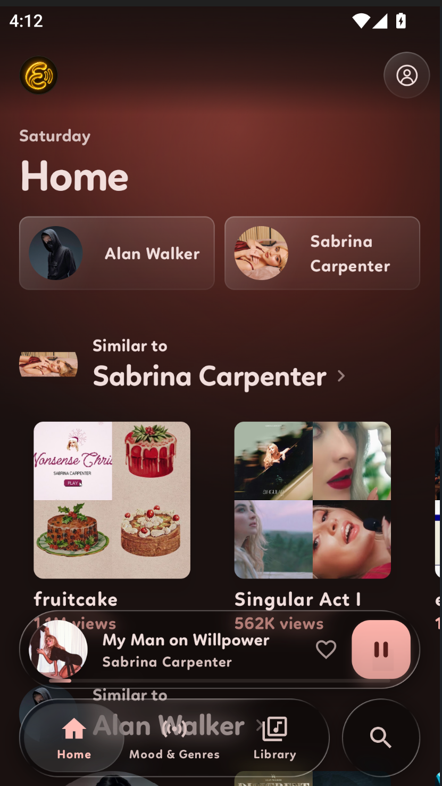
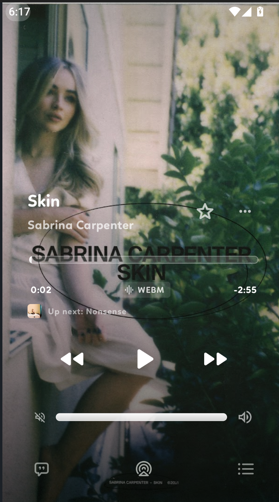
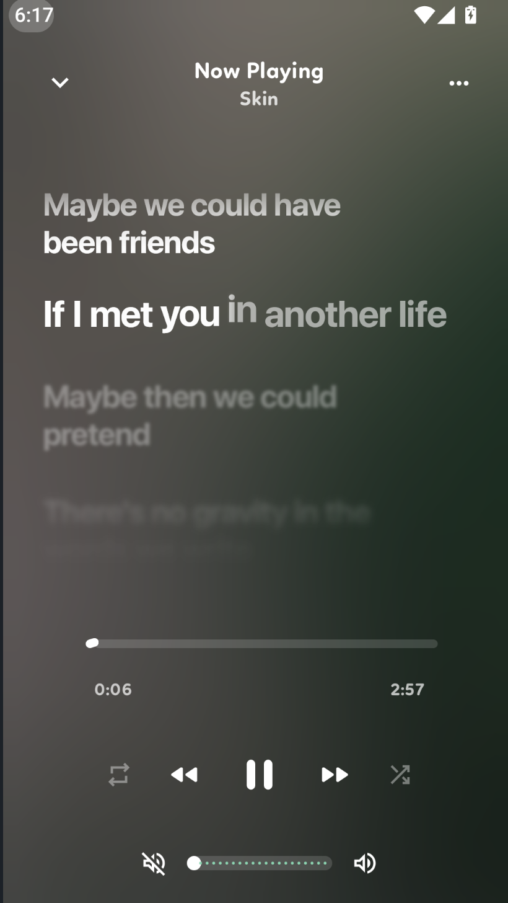
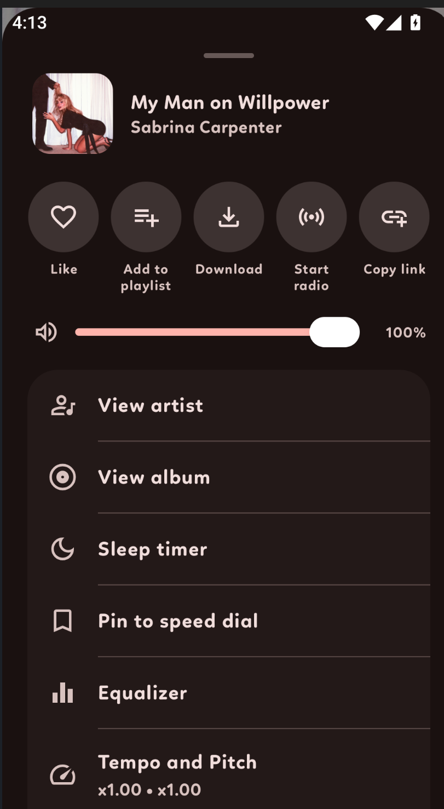
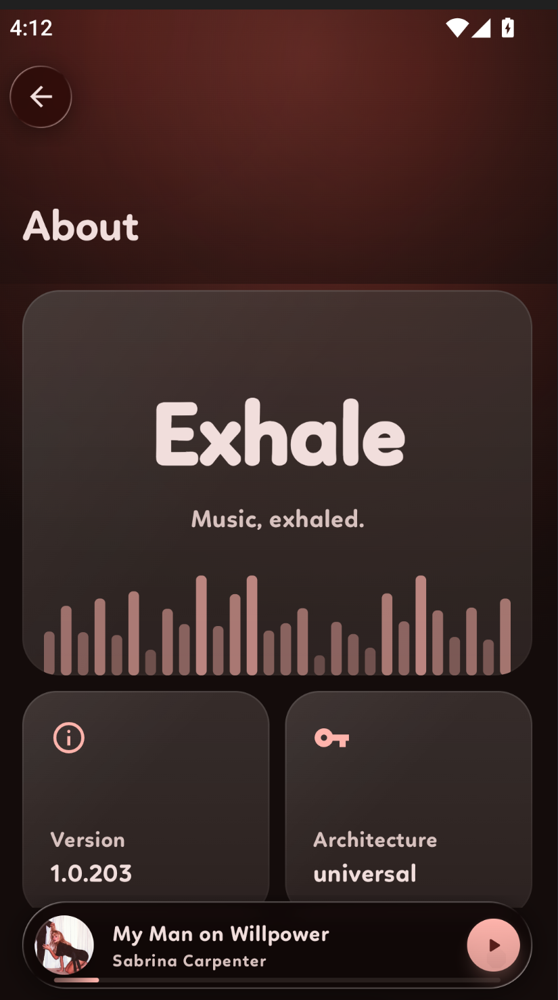

<p align="center">
  
</p>

<h1 align="center">Exhale</h1>

<p align="center">
  <em>A fast, open-source music player for Android that doesn't suck.</em>
</p>

<p align="center">
  <a href="https://android.com"></a>
  <a href="https://kotlinlang.org"></a>
  <a href="https://developer.android.com/jetpack/compose"></a>
  <a href="LICENSE"></a>
</p>

---

## What is this?

Welcome to **Exhale**. Honestly, I just got tired of music apps that look clunky and run poorly, so I built this.

The goal was simple: combine the slick, glassy look of Apple Music with the straightforward layout of Spotify. I added what I'm calling a "Brina Glass" effect — the background is a slow, moving gradient that blurs behind frosted glass panels. It looks great while music is playing.

I also spent way too much time on the animations. Scrolling feels bouncy, buttons actually react when you press them, and the whole thing recolors itself to match your album art. It's the little things.

## Features

- **Brina Glass UI** — live, dynamic backdrop blurs. (Shoutout to [Haze](https://github.com/chrisbanes/haze) for making this possible.)
- **Dynamic theming** — the app's colors adapt to whatever album art is on screen, and you can build your own themes from scratch.
- **Synced lyrics** — real-time, line-by-line lyrics that follow the track.
- **Stream & offline** — play directly or download tracks for when you've got no signal.
- **Built-in equalizer** — tweak the sound to taste.
- **Scrobbling** — Last.fm and ListenBrainz support so your listening history stays yours.
- **Discord Rich Presence** — show off what you're playing.
- **Android Auto** — take it on the road.
- **Music Together** — listen in sync with friends.
- **Always-on display** — a nice now-playing screen when your phone's idle.
- **Backup & restore** — your library and settings, portable.
- **100% Kotlin + Jetpack Compose** — no legacy Views, all modern UI.

## Requirements

- Android 13 (API 33) or newer.

## Screenshots

<p align="center">
  
  
  
  
  
</p>

## Want to try it?

- **GitHub Releases** — grab the latest `.apk` from the [Releases](https://github.com/ozyern/Exhale/releases) page.
- **F-Droid** — coming soon.

## Building from source

```bash
git clone https://github.com/ozyern/Exhale.git
cd Exhale
./gradlew assembleUniversalDebug
```

The APK lands in `app/build/outputs/apk/universal/debug/`. You'll need JDK 21 and SDK Platform 37.

There are five ABI flavors, so plain `assembleDebug` builds all of them — use
`assembleUniversalDebug` for one APK that runs anywhere, or `assembleArm64Debug` if you're
only testing on a modern phone. More in the [Contributing Guidelines](CONTRIBUTING.md).

## Credits

A massive thanks to the original developer of **OpenTune**. Exhale is built directly on top of their work — without it, this project wouldn't exist. Check out the OG repo: [OpenTune by Arturo254](https://github.com/Arturo254/OpenTune).

## Contributing

Pull requests are always welcome — a bug fix, a UI tweak, even a typo. Check out the [Contributing Guidelines](CONTRIBUTING.md) if you want to dive in.

## License

Exhale is released under the [GNU GPL v3](LICENSE).

---

<p align="center">
  Built for the Android community.
</p>
